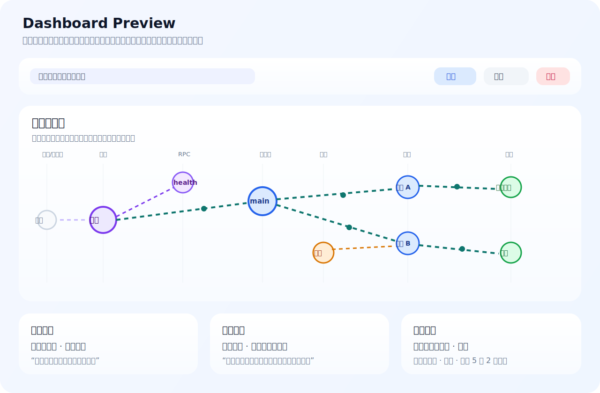
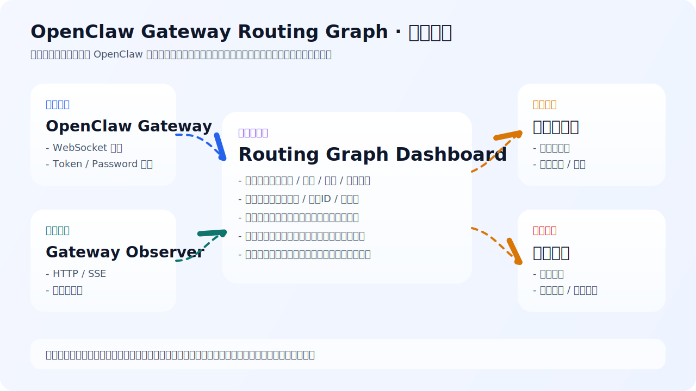

# OpenClaw Gateway Routing Graph

[](https://github.com/sunbao/openclaw-gateway-routing-graph/releases/tag/v2026.3.16)
[](./LICENSE)
[](./package.json)
[](./package.json)

一个独立的、中文优先的 OpenClaw 网关链路可视化项目。

它不修改 OpenClaw 主工程代码，而是以外部监控工具的方式，实时观察消息入口、会话流转、智能体处理、工具调用、渠道回写和健康检查等链路行为。

> 下一阶段规划已经公开：`ROADMAP.md` 与 `OPENSPEC.md`  
> 其中策略控制系统的正式开发触发条件为：**GitHub Star > 100**

## 项目导航

- 版本路线：`ROADMAP.md`
- 公开规格：`OPENSPEC.md`
- 变更说明：`CHANGELOG.md`
- 发布文案：`RELEASE_NOTES.md`
- 参与协作：`CONTRIBUTING.md`
- 开源协议：`LICENSE`

## 界面预览



## 快速开始

```bash
npm install
npm run dev
```

打开页面后，优先使用观察器模式接入：

```text
http://127.0.0.1:17777
```

如果需要浏览器同源 WebSocket 代理：

```bash
GATEWAY_URL=ws://127.0.0.1:18789 npm run serve:build
```

## 架构图



## 当前状态

- 当前定义范围内的 **V1 核心功能已经闭环**，可以单独运行、单独部署、单独验收。
- 后续仍可以继续做界面细化、布局优化和更多业务字段展示，但这些属于增强迭代，不是当前版本可用性的前提。
- 当前仓库已经整理为 **可公开 clone、可直接安装、可直接运行** 的独立开源项目。

## 后续规划

- 已公开路线图：见 `ROADMAP.md`
- 已公开需求规格草案：见 `OPENSPEC.md`
- 下一阶段重点是“风险治理与策略控制”，不是继续堆叠零散界面修改
- 正式进入该阶段开发的门槛为：**GitHub Star > 100**

### 当前已完成

- 直接连接 OpenClaw 网关 WebSocket
- 通过 `tools/openclaw-gateway-observer` 连接 HTTP/SSE 观察器
- 实时链路图，默认常显骨架，有数据时对节点和连线做动态高亮
- 业务优先视图：入口消息、出口消息、活跃会话、实时链路
- 技术事件明细：保留完整事件视角用于排障
- 会话摘要卡片：展示渠道、会话类型、最近入口、最近出口
- 中文标签规则：可视化配置 `类型 / 原始ID / 中文名`
- 浏览器本地保存标签规则，修改后立即生效
- 内置同源 WebSocket 代理，解决浏览器直连网关时常见的 `1006` / 升级失败问题
- 连接异常的中文包装提示
- 内置健康检查和周期性健康探测

### 当前明确不做

- 不改 OpenClaw 主工程源码
- 不做旧规则语法兼容
- 不做兜底式 UI/规则兼容层
- 不默认展示完整消息正文、完整工具输出或敏感长文本

## 开源信息

- GitHub 仓库：`sunbao/openclaw-gateway-routing-graph`
- 授权协议：MIT，见 `LICENSE`
- 当前首版变更说明：见 `CHANGELOG.md`
- 当前首版发布文案：见 `RELEASE_NOTES.md`
- 外部协作说明：见 `CONTRIBUTING.md`
- 后续版本路线：见 `ROADMAP.md`
- 策略控制公开规格：见 `OPENSPEC.md`

## 项目原则

- 始终保持独立项目形态，不与 OpenClaw 主工程形成紧耦合
- 始终按最新交互和最新规则维护，不保留历史兼容写法
- 始终优先展示业务可读信息，技术细节默认下沉到折叠区

## 运行方式

### 1) 本地开发

在当前目录执行：

```bash
npm install
npm run dev
```

默认使用 Vite 本地开发服务。
仓库不依赖本地 `../openclaw` 目录，clone 后可直接安装。

### 2) 构建后本地预览

```bash
npm run build
npm run preview
```

### 3) 构建后用内置静态服务启动

```bash
npm run build
npm run serve
```

默认监听：

- `HOST=127.0.0.1`
- `PORT=5173`

### 4) 一条命令构建并启动

```bash
npm run serve:build
```

## 连接模式

### 观察器模式（推荐）

先运行 `tools/openclaw-gateway-observer`，再在页面里填：

```text
http://127.0.0.1:17777
```

此模式会：

- 先通过 `/events` 获取初始事件
- 再通过 `/stream` 持续接收实时事件

### 直连网关模式

如果你的网关允许浏览器直接连 WebSocket，可以直接填：

```text
ws://127.0.0.1:18789
```

如网关启用了认证，再补充：

- Token
- Password

## 浏览器直连报 `1006` 怎么办

有些网关或代理会拒绝浏览器跨域 WebSocket 升级。这时可以使用本项目自带的同源 WS 代理。

启动方式：

```bash
GATEWAY_URL=ws://127.0.0.1:18789 npm run serve:build
```

然后在页面里把地址填成：

```text
ws://127.0.0.1:5173/__routing_graph/ws
```

这样浏览器只连当前页面同源地址，由本项目服务端转发到真实网关。

## 远程网关建议

如果网关部署在远端机器，推荐优先使用 SSH 隧道，而不是把管理 WebSocket 端口直接暴露到局域网。

示例：

```bash
ssh -N -L 18789:127.0.0.1:18789 root@<gateway-host>
```

之后在页面中使用：

```text
ws://127.0.0.1:18789
```

## 界面说明

### 实时链路图

- 默认始终显示链路骨架
- 新事件进入时，对真实节点和真实连线做动态高亮
- 重点关注入口、智能体、会话、渠道、工具之间的流转

### 业务板块

- 关键指标
- 最新入口消息
- 最新出口消息
- 活跃会话摘要

### 技术板块

- 高级设置
- 技术事件明细
- 原始技术详情折叠查看

## 标签规则

标签规则采用当前唯一有效格式：

- `类型`
- `原始ID`
- `中文名`

例如：

- `channel | wecom | 企业微信`
- `channel | feishu | 飞书渠道`
- `agent | main | 主智能体`
- `session | agent:main:wecom:group:room-1 | 产品群会话`

当前界面中已经改为可视化规则编辑，不再推荐手写文本块。

## 目录结构

```text
src/                 前端源码
server/              构建产物静态服务和 WS 代理
dist/                构建输出
index.html           入口页
vite.config.ts       Vite 配置
```

## 适用边界

这个项目适合用来：

- 演示 OpenClaw 网关消息链路
- 观察渠道到智能体的会话流转
- 验收工具调用、渠道回写和会话活动
- 做现场驾驶舱和实时监控屏

这个项目当前不适合用来：

- 替代日志平台
- 替代审计系统
- 长期存储全量原始事件
- 做侵入式网关内核改造

## 开发说明

- 当前仓库为独立项目仓库
- 当前版本以“可运行、可部署、可验收”为主
- 如继续扩展，优先方向应是：可读性、布局稳定性、更多业务字段，而不是兼容历史写法
- 发布节奏建议采用“小步快跑”：界面优化、字段扩展、布局稳定性优化分别独立发版
